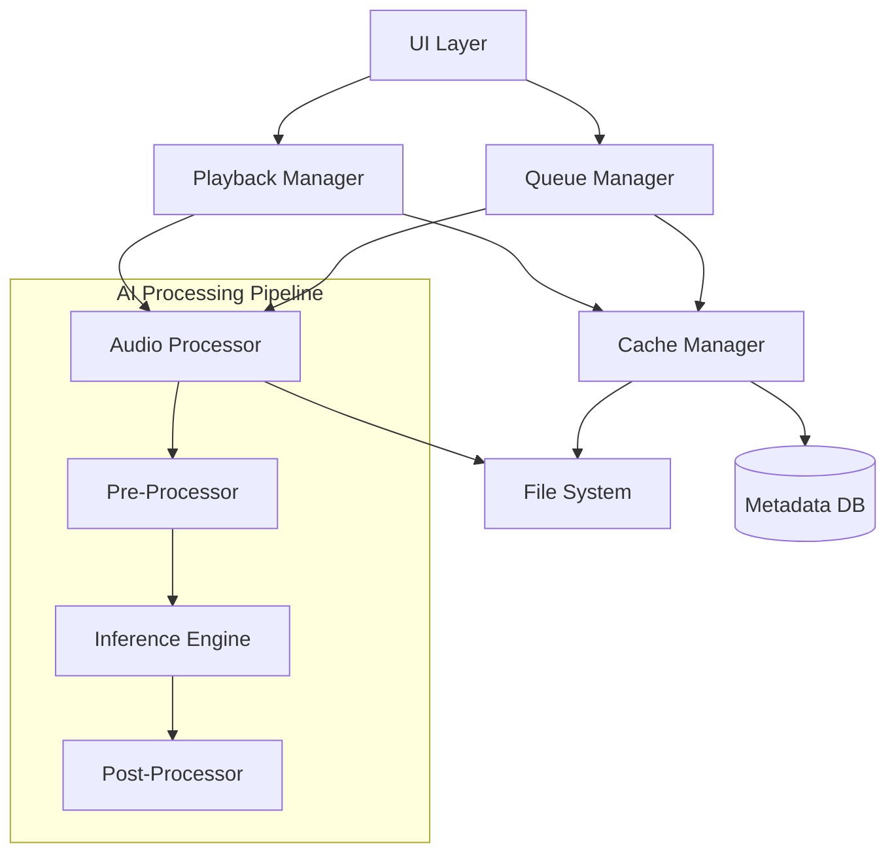
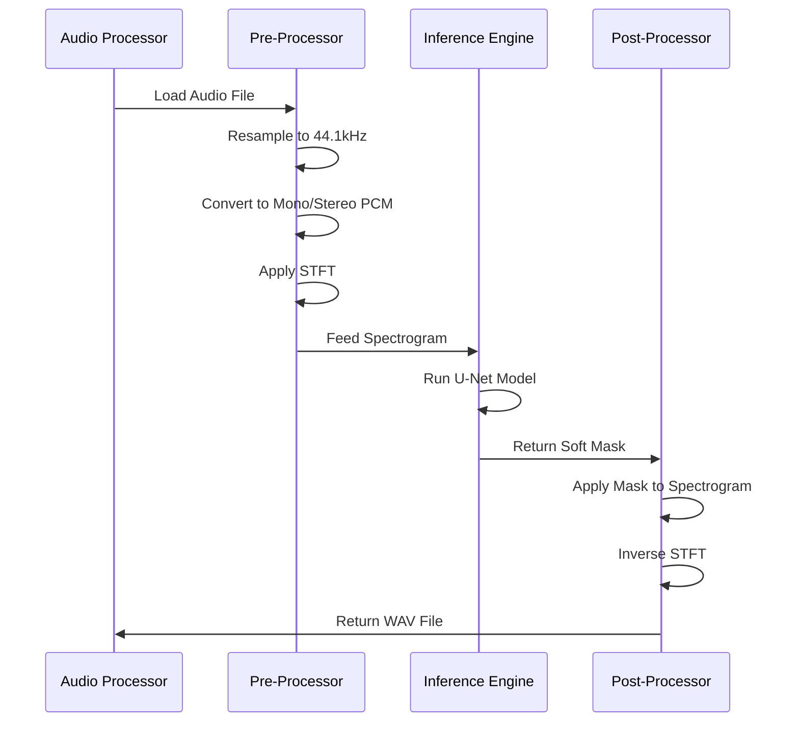

# Design Document

## Overview

The Local Vocal Remover & Music Player implements a "Convert-then-Play" architecture where audio files are processed through an AI model to extract instrumental stems before playback. The system uses intelligent background processing to pre-convert upcoming tracks, ensuring seamless user experience without real-time streaming overhead.

### Key Design Principles

1. **Offline-First**: All processing occurs on-device using quantized neural networks
2. **Non-Blocking UX**: Background processing prevents UI freezes during AI inference
3. **Smart Caching**: LRU-based cache management balances storage and performance
4. **Platform Optimization**: Native frameworks leverage hardware acceleration (Neural Engine on iOS, NNAPI on Android)

## Architecture

### High-Level System Architecture



### Component Layers

1. **Presentation Layer**: SwiftUI (iOS) / Jetpack Compose (Android)
2. **Business Logic Layer**: Playback Manager, Queue Manager, Cache Manager
3. **Processing Layer**: Audio Processor with AI Pipeline
4. **Data Layer**: File System Access, Metadata Database
5. **Platform Layer**: CoreML/TensorFlow Lite, AVAudioEngine/ExoPlayer

## Components and Interfaces

### 1. Library Manager

**Responsibility**: Discover, import, and manage local audio files

**Interface**:
```dart
abstract class LibraryManager {
  Future<List<AudioFile>> scanLocalFiles();
  Future<AudioFile> importFile(String path);
  Future<Metadata?> getMetadata(AudioFile file);
  Future<bool> isDRMProtected(AudioFile file);
}
```

**Key Behaviors**:
- **Mobile**: Scans device storage using platform APIs (FileManager on iOS, MediaStore on Android)
- **Web**: Uses File System Access API or file picker for user-selected files
- Filters supported formats: MP3, WAV, M4A, FLAC
- Extracts ID3 tags for metadata display
- **Mobile**: Detects DRM protection using AVAsset.isPlayable (iOS) or MediaExtractor error codes (Android)
- **Web**: Attempts to decode audio; DRM files will fail at decode stage

### 2. Audio Processor

**Responsibility**: Execute AI-based vocal removal pipeline

**Interface**:
```dart
abstract class AudioProcessor {
  Future<String> processAudio(
    AudioFile input,
    void Function(double progress) progressCallback,
  );
  void cancelProcessing(String taskId);
}
```

**Processing Pipeline**:



**Implementation Details**:
- **Pre-Processing**: 
  - **Mobile**: Load audio using AVAudioFile (iOS) or AudioTrack (Android)
  - **Web**: Load audio using Web Audio API AudioContext.decodeAudioData()
  - Resample to 44.1kHz using platform-specific resampler
  - Generate spectrogram using FFT (vDSP on iOS, KissFFT on Android, Web Audio API on web)
  - Normalize input to [-1, 1] range
  
- **Inference**:
  - **iOS**: CoreML with MLModel, utilize Neural Engine via MLComputeUnits.all (via platform channel)
  - **Android**: TensorFlow Lite with NNAPI delegate for GPU/NPU acceleration
  - **Web**: TensorFlow.js with WebGL backend for GPU acceleration
  - Model input: Float32 spectrogram [batch, freq_bins, time_frames, channels]
  - Model output: Float32 mask [batch, freq_bins, time_frames, channels]
  
- **Post-Processing**:
  - Apply soft mask: instrumental_spec = input_spec * mask
  - Inverse STFT using platform-specific IFFT
  - **Mobile**: Write to WAV file using AVAssetWriter (iOS) or AudioRecord (Android)
  - **Web**: Create Blob from audio data, store in Cache API

### 3. Queue Manager

**Responsibility**: Manage playback queue and trigger look-ahead processing

**Interface**:
```dart
abstract class QueueManager {
  AudioFile? get currentTrack;
  AudioFile? get nextTrack;
  List<AudioFile> get queue;
  
  void enqueue(AudioFile file);
  void skip();
  void shuffle();
  void setRepeatMode(RepeatMode mode);
}
```

**Look-Ahead Logic**:
```
ON_TRACK_STARTED:
  1. Identify next_track in queue
  2. Check if cache.hasProcessed(next_track)
  3. If NOT cached:
     - Spawn background task
     - audioProcessor.processAudio(next_track)
     - Store result in cache
  4. Monitor for skip events

ON_SKIP:
  1. Cancel current background task
  2. Update next_track to new selection
  3. Trigger look-ahead for new next_track
```

### 4. Cache Manager

**Responsibility**: Store and retrieve processed instrumental files with LRU eviction

**Interface**:
```dart
abstract class CacheManager {
  Future<String?> getCachedInstrumental(AudioFile file);
  Future<void> storeInstrumental(String path, AudioFile file);
  Future<void> evictOldEntries();
  Future<int> getCacheSize();
}
```

**Storage Strategy**:
- **Mobile**: Application cache directory (Library/Caches on iOS, getCacheDir() on Android)
- **Web**: IndexedDB for metadata, Cache API for audio files
- Naming: SHA256 hash of original file path + ".wav"
- Metadata DB tracks: file_hash, last_played_date, file_size, original_path

**LRU Eviction Algorithm**:
```
ON_CACHE_FULL or ON_LOW_STORAGE:
  1. Query DB for entries WHERE last_played < (NOW - 30 days)
  2. Sort by last_played ASC
  3. Delete files until cache_size < MAX_CACHE_SIZE (1GB)
  4. Update DB to remove deleted entries
```

### 5. Playback Manager

**Responsibility**: Control audio playback with seamless transitions

**Interface**:
```dart
abstract class PlaybackManager {
  Future<void> play(AudioFile file);
  void pause();
  void resume();
  void seek(Duration position);
  void setVolume(double volume);
  
  bool get isPlaying;
  Duration get currentTime;
  Duration get duration;
}
```

**Playback Flow**:
```
ON_PLAY_REQUESTED(file):
  1. instrumental_url = cacheManager.getCachedInstrumental(file)
  2. If instrumental_url == nil:
     - Show "Processing..." UI
     - instrumental_url = await audioProcessor.processAudio(file)
     - cacheManager.storeInstrumental(instrumental_url, file)
  3. Load instrumental_url into player
  4. Start playback
  5. Notify queueManager to trigger look-ahead
```

**Platform-Specific Players**:
- **Flutter**: `just_audio` package with platform-specific backends
  - iOS: AVAudioEngine backend
  - Android: ExoPlayer backend
- Unified API across platforms with consistent behavior

## Data Models

### AudioFile
```dart
class AudioFile {
  final String id;
  final String path;
  final String title;
  final String? artist;
  final String? album;
  final Duration duration;
  final AudioFormat format;
  final bool isDRMProtected;
  final Uint8List? albumArtwork;
  
  AudioFile({
    required this.id,
    required this.path,
    required this.title,
    this.artist,
    this.album,
    required this.duration,
    required this.format,
    required this.isDRMProtected,
    this.albumArtwork,
  });
}

enum AudioFormat {
  mp3,
  wav,
  m4a,
  flac,
}
```

### CacheEntry
```dart
class CacheEntry {
  final String fileHash;
  final String instrumentalPath;
  final String originalPath;
  final int fileSize;
  final DateTime lastPlayed;
  final DateTime createdAt;
  
  CacheEntry({
    required this.fileHash,
    required this.instrumentalPath,
    required this.originalPath,
    required this.fileSize,
    required this.lastPlayed,
    required this.createdAt,
  });
}
```

### ProcessingTask
```dart
class ProcessingTask {
  final String id;
  final AudioFile audioFile;
  final TaskStatus status;
  final double progress;
  final DateTime startTime;
  
  ProcessingTask({
    required this.id,
    required this.audioFile,
    required this.status,
    required this.progress,
    required this.startTime,
  });
}

enum TaskStatus {
  queued,
  processing,
  completed,
  cancelled,
  failed,
}
```

## Error Handling

### Error Types

```dart
class VocalRemoverError implements Exception {
  final String message;
  final ErrorType type;
  
  VocalRemoverError(this.type, this.message);
}

enum ErrorType {
  unsupportedFormat,
  drmProtected,
  processingFailed,
  insufficientStorage,
  modelLoadFailed,
  audioDecodeFailed,
  cacheWriteFailed,
}
```

### Error Recovery Strategies

| Error | User Impact | Recovery Action |
|-------|-------------|-----------------|
| `drmProtected` | Cannot process file | Display error message, gray out file in library |
| `processingFailed` | Cannot play instrumental | Retry once, fallback to original audio if retry fails |
| `insufficientStorage` | Cannot cache result | Trigger aggressive cache eviction, process without caching |
| `modelLoadFailed` | App cannot function | Display critical error, prompt user to reinstall |
| `audioDecodeFailed` | Cannot play file | Skip to next track, log error for debugging |

### User-Facing Error Messages

- DRM: "This file is protected and cannot be processed. Try importing an unprotected version."
- Processing Failed: "Unable to remove vocals from this track. Playing original audio."
- Storage Full: "Device storage is low. Some processed tracks may need to be regenerated."

## Testing Strategy

### Unit Testing

**Components to Test**:
1. **Audio Processor**: Mock AI model, verify pre/post-processing logic
2. **Cache Manager**: Test LRU eviction with various scenarios
3. **Queue Manager**: Verify look-ahead triggering and cancellation
4. **Library Manager**: Test DRM detection and metadata extraction

**Test Cases**:
- Cache eviction when storage exceeds 1GB
- Background task cancellation on skip
- Metadata extraction from various file formats
- LRU ordering with different access patterns

### Integration Testing

**Scenarios**:
1. **End-to-End Processing**: Import file → Process → Cache → Playback
2. **Queue Transitions**: Play song A → Verify song B processes in background → Skip to B → Verify instant playback
3. **Cache Hit/Miss**: Play processed song → Verify no re-processing → Clear cache → Verify re-processing
4. **Error Handling**: Attempt to play DRM file → Verify error message → Verify app remains stable

### Performance Testing

**Metrics**:
- Processing time for 3-minute song on target devices (< 30 seconds)
- Memory usage during processing (< 500MB peak)
- Battery drain during 1-hour playback session (< 10% on flagship devices)
- Cache lookup time (< 50ms)
- UI responsiveness during background processing (60 FPS maintained)

**Test Devices**:
- iOS: iPhone 13, iPhone 15 Pro
- Android: Pixel 6, Samsung Galaxy S23

### Model Validation

**Pre-Deployment**:
- Convert Spleeter/Demucs model to CoreML and TFLite
- Verify output quality using Signal-to-Distortion Ratio (SDR) metrics
- Test quantized model accuracy vs. full-precision baseline
- Validate model size < 50MB

## Platform-Specific Considerations

### Flutter Cross-Platform Implementation

**Framework Stack**:
- Flutter 3.16+ for cross-platform UI (iOS, Android, Web)
- Dart 3.0+ for business logic
- Platform channels for native integration (mobile)
- Web APIs and WASM for web platform

**Key Flutter Packages**:
- `tflite_flutter` / `tflite_flutter_web` - TensorFlow Lite inference across platforms
- `just_audio` / `just_audio_web` - Audio playback with platform-specific backends
- `file_picker` - Local file selection (mobile and web)
- `path_provider` - Access to cache directories (mobile)
- `sqflite` / `idb_shim` - Database for metadata (mobile uses SQLite, web uses IndexedDB)
- `flutter_isolate` - Background processing without blocking UI (mobile)

**Platform-Specific Integration**:

**iOS**:
- Use platform channels to access CoreML for optimal Neural Engine performance
- Fallback to TFLite if CoreML integration is complex
- AVAudioEngine via MethodChannel for low-latency playback
- Background processing via `DispatchQueue` through platform channel

**Android**:
- TFLite with NNAPI delegate via `tflite_flutter`
- ExoPlayer integration through `just_audio` package
- Foreground Service for background processing via platform channel
- MediaStore access for file scanning

**Web**:
- TensorFlow.js via `tflite_flutter_web` for in-browser inference
- Web Audio API through `just_audio_web` for playback
- File System Access API for local file import
- IndexedDB for cache storage and metadata
- Web Workers for background processing without blocking UI
- Cache API for storing processed audio files
- No native file system access - uses browser storage APIs

**Background Processing Strategy**:
- **Mobile**: Use `compute()` function for isolate-based processing
- **Web**: Use Web Workers for parallel processing
- Platform channels for native background tasks when needed (mobile only)
- Maintain UI responsiveness with async/await patterns across all platforms

## Security and Privacy

- All processing occurs on-device/in-browser; no data transmitted to servers
- **Mobile**: Cache stored in app-private directory, inaccessible to other apps
- **Web**: Data stored in browser's IndexedDB and Cache API, isolated per origin
- No user accounts or authentication required
- No analytics or telemetry collection in MVP
- **Web**: Users must explicitly grant file access via file picker (no automatic scanning)

## Future Enhancements (Post-MVP)

- Real-time vocal volume slider (requires streaming architecture)
- Support for 4-stem separation (vocals, drums, bass, other)
- Playlist management and favorites
- Export instrumental stems to Files app
- Integration with music streaming services (pending API availability)
