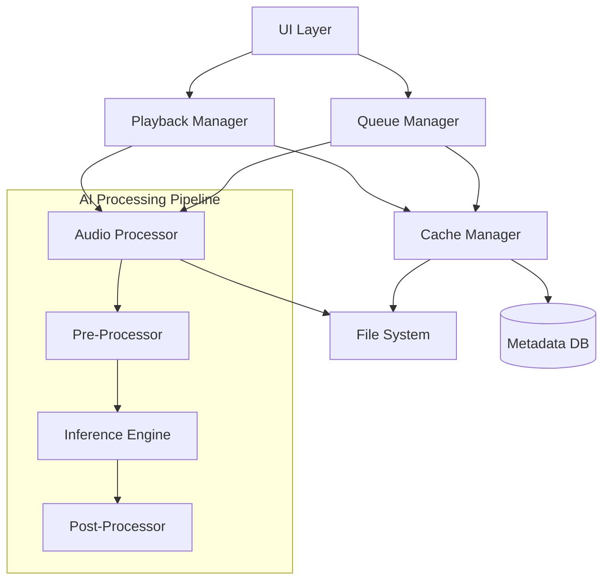
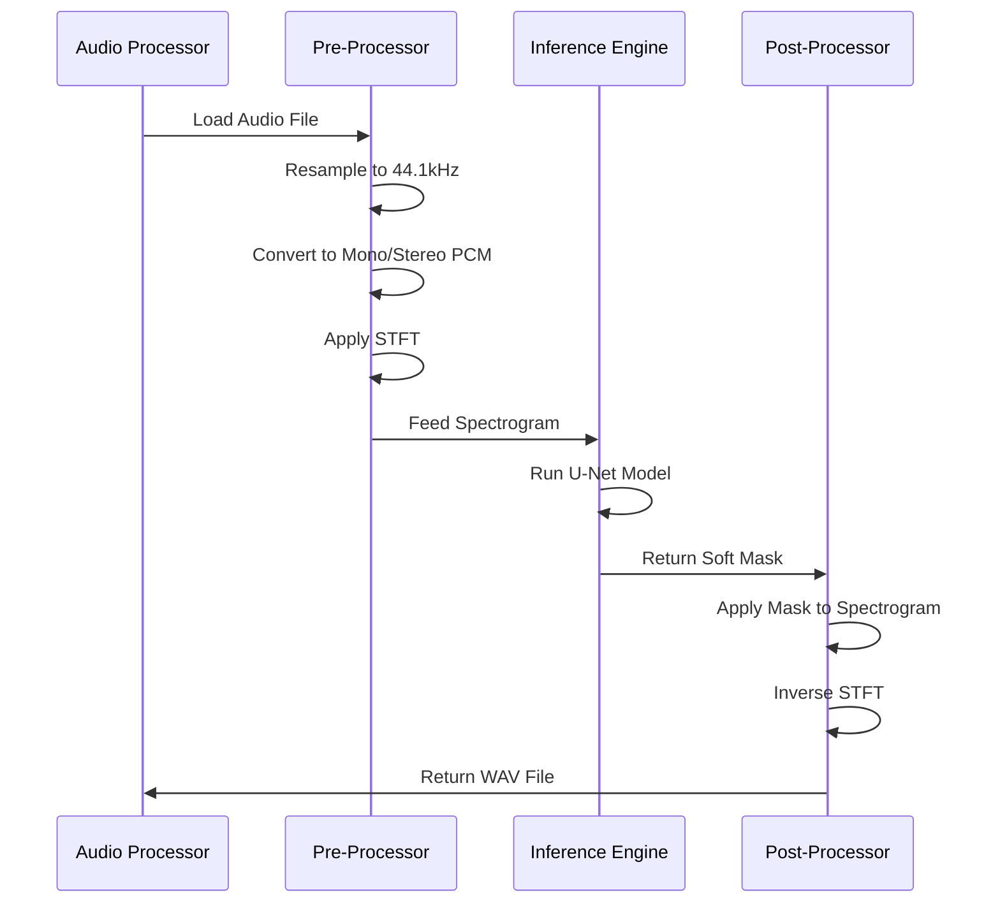

# Design Document

## Overview

The Local Vocal Remover & Music Player implements a "Convert-then-Play" architecture where audio files are processed through an AI model to extract instrumental stems before playback. The system uses intelligent background processing to pre-convert upcoming tracks, ensuring seamless user experience without real-time streaming overhead.

### Key Design Principles

1. **Offline-First**: All processing occurs on-device using quantized neural networks
2. **Non-Blocking UX**: Background processing prevents UI freezes during AI inference
3. **Smart Caching**: LRU-based cache management balances storage and performance
4. **Platform Optimization**: Native frameworks leverage hardware acceleration (Neural Engine on iOS, NNAPI on Android)

## Architecture

### High-Level System Architecture



### Component Layers

1. **Presentation Layer**: SwiftUI (iOS) / Jetpack Compose (Android)
2. **Business Logic Layer**: Playback Manager, Queue Manager, Cache Manager
3. **Processing Layer**: Audio Processor with AI Pipeline
4. **Data Layer**: File System Access, Metadata Database
5. **Platform Layer**: CoreML/TensorFlow Lite, AVAudioEngine/ExoPlayer

## Components and Interfaces

### 1. Library Manager

**Responsibility**: Discover, import, and manage local audio files

**Interface**:
```swift
protocol LibraryManager {
    func scanLocalFiles() async -> [AudioFile]
    func importFile(url: URL) async throws -> AudioFile
    func getMetadata(for file: AudioFile) -> Metadata?
    func isDRMProtected(file: AudioFile) -> Bool
}
```

**Key Behaviors**:
- Scans device storage using platform APIs (FileManager on iOS, MediaStore on Android)
- Filters supported formats: MP3, WAV, M4A, FLAC
- Extracts ID3 tags for metadata display
- Detects DRM protection using AVAsset.isPlayable (iOS) or MediaExtractor error codes (Android)

### 2. Audio Processor

**Responsibility**: Execute AI-based vocal removal pipeline

**Interface**:
```swift
protocol AudioProcessor {
    func processAudio(input: AudioFile, 
                     progressCallback: @escaping (Float) -> Void) async throws -> URL
    func cancelProcessing(taskId: UUID)
}
```

**Processing Pipeline**:



**Implementation Details**:
- **Pre-Processing**: 
  - Load audio using AVAudioFile (iOS) or AudioTrack (Android)
  - Resample to 44.1kHz using AVAudioConverter / Resampler
  - Generate spectrogram using vDSP (iOS) or KissFFT (Android)
  - Normalize input to [-1, 1] range
  
- **Inference**:
  - iOS: CoreML with MLModel, utilize Neural Engine via MLComputeUnits.all
  - Android: TensorFlow Lite with NNAPI delegate for GPU/NPU acceleration
  - Model input: Float32 spectrogram [batch, freq_bins, time_frames, channels]
  - Model output: Float32 mask [batch, freq_bins, time_frames, channels]
  
- **Post-Processing**:
  - Apply soft mask: instrumental_spec = input_spec * mask
  - Inverse STFT using vDSP.DFT (iOS) or custom IFFT (Android)
  - Write to WAV file using AVAssetWriter (iOS) or AudioRecord (Android)

### 3. Queue Manager

**Responsibility**: Manage playback queue and trigger look-ahead processing

**Interface**:
```swift
protocol QueueManager {
    var currentTrack: AudioFile? { get }
    var nextTrack: AudioFile? { get }
    var queue: [AudioFile] { get set }
    
    func enqueue(_ file: AudioFile)
    func skip()
    func shuffle()
    func setRepeatMode(_ mode: RepeatMode)
}
```

**Look-Ahead Logic**:
```
ON_TRACK_STARTED:
  1. Identify next_track in queue
  2. Check if cache.hasProcessed(next_track)
  3. If NOT cached:
     - Spawn background task
     - audioProcessor.processAudio(next_track)
     - Store result in cache
  4. Monitor for skip events

ON_SKIP:
  1. Cancel current background task
  2. Update next_track to new selection
  3. Trigger look-ahead for new next_track
```

### 4. Cache Manager

**Responsibility**: Store and retrieve processed instrumental files with LRU eviction

**Interface**:
```swift
protocol CacheManager {
    func getCachedInstrumental(for file: AudioFile) -> URL?
    func storeInstrumental(url: URL, for file: AudioFile) async throws
    func evictOldEntries() async
    func getCacheSize() -> Int64
}
```

**Storage Strategy**:
- Location: Application cache directory (Library/Caches on iOS, getCacheDir() on Android)
- Naming: SHA256 hash of original file path + ".wav"
- Metadata DB tracks: file_hash, last_played_date, file_size, original_path

**LRU Eviction Algorithm**:
```
ON_CACHE_FULL or ON_LOW_STORAGE:
  1. Query DB for entries WHERE last_played < (NOW - 30 days)
  2. Sort by last_played ASC
  3. Delete files until cache_size < MAX_CACHE_SIZE (1GB)
  4. Update DB to remove deleted entries
```

### 5. Playback Manager

**Responsibility**: Control audio playback with seamless transitions

**Interface**:
```swift
protocol PlaybackManager {
    func play(file: AudioFile) async throws
    func pause()
    func resume()
    func seek(to position: TimeInterval)
    func setVolume(_ volume: Float)
    
    var isPlaying: Bool { get }
    var currentTime: TimeInterval { get }
    var duration: TimeInterval { get }
}
```

**Playback Flow**:
```
ON_PLAY_REQUESTED(file):
  1. instrumental_url = cacheManager.getCachedInstrumental(file)
  2. If instrumental_url == nil:
     - Show "Processing..." UI
     - instrumental_url = await audioProcessor.processAudio(file)
     - cacheManager.storeInstrumental(instrumental_url, file)
  3. Load instrumental_url into player
  4. Start playback
  5. Notify queueManager to trigger look-ahead
```

**Platform-Specific Players**:
- **iOS**: AVAudioEngine with AVAudioPlayerNode for precise control
- **Android**: ExoPlayer (Media3) with custom MediaSource for local files

## Data Models

### AudioFile
```swift
struct AudioFile: Identifiable {
    let id: UUID
    let url: URL
    let title: String
    let artist: String?
    let album: String?
    let duration: TimeInterval
    let format: AudioFormat
    let isDRMProtected: Bool
    let albumArtwork: Data?
}

enum AudioFormat {
    case mp3, wav, m4a, flac
}
```

### CacheEntry
```swift
struct CacheEntry {
    let fileHash: String
    let instrumentalURL: URL
    let originalPath: String
    let fileSize: Int64
    let lastPlayed: Date
    let createdAt: Date
}
```

### ProcessingTask
```swift
struct ProcessingTask {
    let id: UUID
    let audioFile: AudioFile
    let status: TaskStatus
    let progress: Float
    let startTime: Date
}

enum TaskStatus {
    case queued, processing, completed, cancelled, failed
}
```

## Error Handling

### Error Types

```swift
enum VocalRemoverError: Error {
    case unsupportedFormat
    case drmProtected
    case processingFailed(reason: String)
    case insufficientStorage
    case modelLoadFailed
    case audioDecodeFailed
    case cacheWriteFailed
}
```

### Error Recovery Strategies

| Error | User Impact | Recovery Action |
|-------|-------------|-----------------|
| `drmProtected` | Cannot process file | Display error message, gray out file in library |
| `processingFailed` | Cannot play instrumental | Retry once, fallback to original audio if retry fails |
| `insufficientStorage` | Cannot cache result | Trigger aggressive cache eviction, process without caching |
| `modelLoadFailed` | App cannot function | Display critical error, prompt user to reinstall |
| `audioDecodeFailed` | Cannot play file | Skip to next track, log error for debugging |

### User-Facing Error Messages

- DRM: "This file is protected and cannot be processed. Try importing an unprotected version."
- Processing Failed: "Unable to remove vocals from this track. Playing original audio."
- Storage Full: "Device storage is low. Some processed tracks may need to be regenerated."

## Testing Strategy

### Unit Testing

**Components to Test**:
1. **Audio Processor**: Mock AI model, verify pre/post-processing logic
2. **Cache Manager**: Test LRU eviction with various scenarios
3. **Queue Manager**: Verify look-ahead triggering and cancellation
4. **Library Manager**: Test DRM detection and metadata extraction

**Test Cases**:
- Cache eviction when storage exceeds 1GB
- Background task cancellation on skip
- Metadata extraction from various file formats
- LRU ordering with different access patterns

### Integration Testing

**Scenarios**:
1. **End-to-End Processing**: Import file → Process → Cache → Playback
2. **Queue Transitions**: Play song A → Verify song B processes in background → Skip to B → Verify instant playback
3. **Cache Hit/Miss**: Play processed song → Verify no re-processing → Clear cache → Verify re-processing
4. **Error Handling**: Attempt to play DRM file → Verify error message → Verify app remains stable

### Performance Testing

**Metrics**:
- Processing time for 3-minute song on target devices (< 30 seconds)
- Memory usage during processing (< 500MB peak)
- Battery drain during 1-hour playback session (< 10% on flagship devices)
- Cache lookup time (< 50ms)
- UI responsiveness during background processing (60 FPS maintained)

**Test Devices**:
- iOS: iPhone 13, iPhone 15 Pro
- Android: Pixel 6, Samsung Galaxy S23

### Model Validation

**Pre-Deployment**:
- Convert Spleeter/Demucs model to CoreML and TFLite
- Verify output quality using Signal-to-Distortion Ratio (SDR) metrics
- Test quantized model accuracy vs. full-precision baseline
- Validate model size < 50MB

## Platform-Specific Considerations

### iOS Implementation

**Frameworks**:
- SwiftUI for UI
- CoreML for inference
- AVFoundation for audio I/O
- SwiftData for metadata persistence

**Background Processing**:
- Use `DispatchQueue.global(qos: .userInitiated)` for processing
- Request extended background time using `beginBackgroundTask` if app enters background

**Neural Engine Optimization**:
- Set `MLModelConfiguration.computeUnits = .all` to enable Neural Engine
- Use Float16 precision for model weights

### Android Implementation

**Frameworks**:
- Jetpack Compose for UI
- TensorFlow Lite for inference
- ExoPlayer (Media3) for playback
- Room Database for metadata

**Background Processing**:
- Use Foreground Service with notification during processing
- WorkManager for cache eviction tasks

**NNAPI Optimization**:
- Create Interpreter with `NnApiDelegate` for hardware acceleration
- Handle fallback to CPU if NNAPI unavailable

## Security and Privacy

- All processing occurs on-device; no data transmitted to servers
- Cache stored in app-private directory, inaccessible to other apps
- No user accounts or authentication required
- No analytics or telemetry collection in MVP

## Future Enhancements (Post-MVP)

- Real-time vocal volume slider (requires streaming architecture)
- Support for 4-stem separation (vocals, drums, bass, other)
- Playlist management and favorites
- Export instrumental stems to Files app
- Integration with music streaming services (pending API availability)
